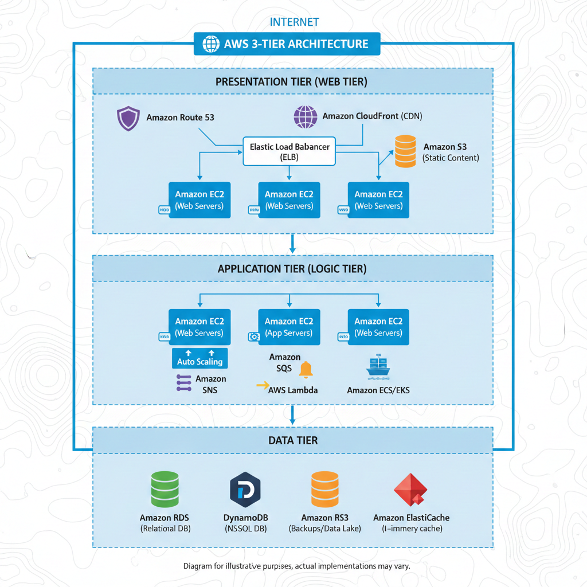

The 3-Tier Architecture is a well-established software architecture pattern that organizes applications into three logical and physical computing tiers: the presentation tier, the application tier, and the data tier.

**1\. Presentation Tier (Web Tier):** This is the topmost layer of the application, which users interact with directly. It typically consists of web servers (like NGINX or Apache) that handle incoming requests, serve static content (HTML, CSS, JavaScript), and often act as a load balancer for the application tier.

**AWS Services commonly used here:**

* **Amazon EC2:** For hosting web servers.  
* **Amazon S3:** For storing static website content.  
* **Amazon CloudFront:** As a Content Delivery Network (CDN) to cache content and reduce latency.  
* **Amazon Route 53:** For DNS management.  
* **Elastic Load Balancing (ELB):** To distribute incoming traffic across multiple web servers.

**2\. Application Tier (Logic Tier):** This middle layer contains the business logic of the application. It processes requests from the presentation tier, performs necessary computations, and communicates with the data tier. This tier often involves application servers running frameworks like Node.js, Python/Django, Java/Spring, etc.

**AWS Services commonly used here:**

* **Amazon EC2:** For hosting application servers.  
* **Auto Scaling:** To automatically adjust the number of instances based on demand.  
* **Amazon SQS/SNS:** For message queuing and notifications, enabling loose coupling between components.  
* **AWS Lambda:** For serverless functions to handle specific application logic.  
* **Amazon ECS/EKS:** For containerized applications.

**3\. Data Tier:** This is the lowest layer and consists of databases and storage mechanisms. It's responsible for storing, retrieving, and managing the application's data. This tier is often isolated from direct internet access for security reasons.

**AWS Services commonly used here:**

* **Amazon RDS:** For managed relational databases (MySQL, PostgreSQL, Oracle, SQL Server, Aurora).  
* **Amazon DynamoDB:** For NoSQL databases.  
* **Amazon S3:** For object storage, backups, and data lakes.  
* **Amazon ElastiCache:** For in-memory caching (Redis, Memcached) to speed up data retrieval.

